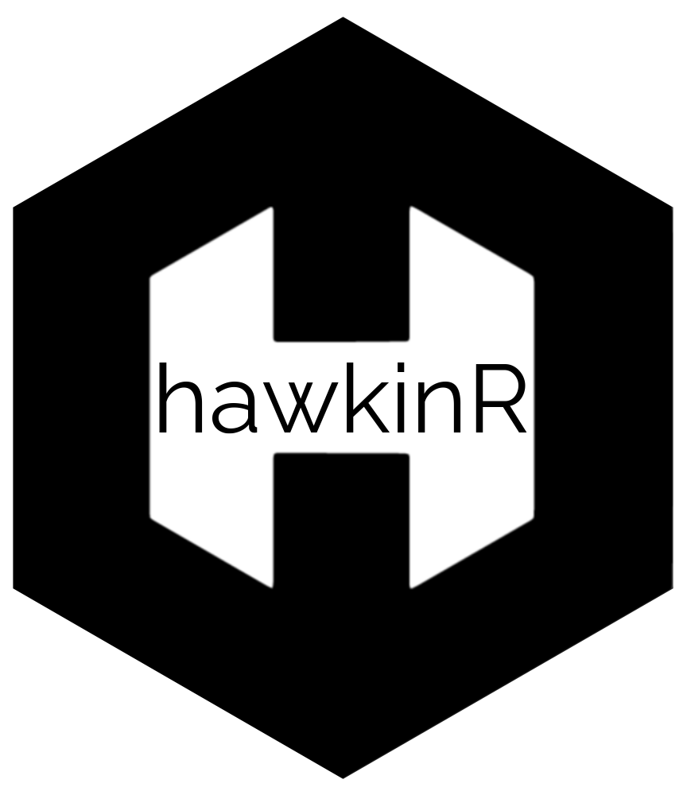

<!-- README.md is generated from README.Rmd. Please edit that file -->

# hawkinR 

**Get your data from the Hawkin Dynamics API**

<!-- badges: start -->

[](https://github.com/HawkinDynamics/hawkinR/actions/workflows/R-CMD-check.yaml)
[)%60-yellowgreen.svg)](/commits/main)
[](https://choosealicense.com/)
[](https://cran.r-project.org/)
[](https://www.repostatus.org/#active)
[](https://www.tidyverse.org/lifecycle/#stable)
[](commits/main)
[](THANKS.md)

<!-- badges: end -->

hawkinR provides simple functionality with Hawkin Dynamics API. These
functions are for use with ‘Hawkin Dynamics Beta API’ version 1.10-beta.
You must be an Hawkin Dynamics user with active integration account to
utilize functions within the package.

## Installation

You can install the development version of hawkinR from
[GitHub](https://github.com/) with:

``` r
# install.packages("devtools")
devtools::install_github("HawkinDynamics/hawkinR")
```

## Functions

This API is designed to get data out of your Hawkin Dynamics database
into your own database. It is not designed to be accessed from client
applications directly. There is a limit on the amount of data that can
be returned in a single request. As your database grows, it will be
necessary to use the from and to parameters to limit the size of the
responses. Responses that exceed the memory limit will fail. It is
advised that you design your client to handle this from the beginning. A
recommended pattern would be to have two methods of fetching data. A
scheduled pull that uses the from and to parameters to constrain the
returned data to only tests that have occurred since the last fetch
e.g. every day or every 5 minutes. And then a pull that fetches the
entire database since you began testing that is only executed when
necessary. A recommended way of doing this is to generate the from and
to parameters for each month since you started and send a request for
each either in parallel or sequentially.

This package was meant to help execute requests to the Hawkin Dynamics
API with a single line of code. There are 11 functions to help execute 4
primary objectives:

------------------------------------------------------------------------

#### Authentication

*hawkinR* uses a **secure, profile-based authentication system**
designed for both local development and production deployment.

##### Key concepts

- Profiles
  - A profile represents a specific authentication context (for example,
    a development token, a production token, or a team-specific token).
  - **Profiles store:**
    - org_name
    - region (Americas, Europe, APAC)
- Secrets
  - API tokens are never stored in plain text.
    - Local development: stored securely using the operating system
      keychain via the keyring package
    - Production deployments: injected via environment variables
- Automatic token refresh
  - Access tokens are refreshed automatically when needed. Users do not
    need to manage token expiration.

##### Local Development (recommended)

1.  Create a Profile

``` r
hd_config_set(
  profile  = "dev",
  org_name = "my_org",
  region   = "Americas"
)
```

2.  Store your API token securely

``` r
hd_auth_set_secret(
  profile = "dev",
  secret  = "<YOUR_API_TOKEN>"
)
```

3.  Use the profile

``` r
hd_config_use("dev")
```

All subsequent API calls will authenticate automatically.

##### Production deployments (Shiny, Plumber, CI/CD)

In production environments, keyring access may not be available.
Instead, inject secrets via environment variables.

Example setup:

``` r
# set by hosting platform
Sys.setenv(
  HAWKINR_PROFILE = "prod",
  HAWKINR_TOKEN   = "<PRODUCTION_API_TOKEN>"
)

# in application startup
hd_config_set(
  profile  = "prod",
  org_name = "my_org",
  region   = "Americas"
)

hd_auth_use_env_secret("HAWKINR_TOKEN")
```

No secrets are written to disk.

##### Checking authentication status

``` r
hd_auth_status()
```

Returns safe diagnostic information, including:

- active profile
- organization
- region
- token validity and expiration

Secrets and tokens are never printed.

##### Resetting authentication

Clear cached access tokens:

``` r
hd_auth_redset()
```

Remove stored secrets (local development only):

``` r
hd_auth_reset(remove_secret = TRUE)
```

------------------------------------------------------------------------

#### Get Test Types

- `get_testTypes()` - Get the test type names and ids for all the test
  types in the system. Response will be a data frame containing the
  tests that are in the HD system.

#### Get Organization Data

- `get_athletes()` - Get the athletes for an account. Inactive players
  will only be included if \`inactive\` parameter is set to TRUE.
  Response will be a data frame containing the athletes that match this
  query.

- `get_teams()` - Get the team names and ids for all the teams in the
  org. Response will be a data frame containing the teams that are in
  the organization.

- `get_groups()` - Get the group names and ids for all the groups in the
  org. Response will be a data frame containing the groups that are in
  the organization.

#### Get Test Data

- `get_forcetime()` - Get the force-time data for a specific test by id.
  This includes both left, right and combined force data at 1000hz (per
  millisecond). Calculated velocity, displacement, and power at each
  time interval will also be included.

- `get_tests()` - Get the tests for an account. You can specify none or
  any 1 of the parameters athlete, test type, teams or groups; as well
  as a time frame from, or to, which the tests should come (or be
  synced). Response will be a data frame containing the trials within
  the time range (if specified).

*Previous variations of `get_tests_` (found in versions \< hawkinR
v1.1.0) have been deprecated and are to be phased out in future updates.
See* `get_tests()` *for the preferred function.*

- `get_tests_type()` - ***Deprecated*** Get only tests of the specified
  type for an account. Response will be a data frame containing the
  trials of the specified type and within the time range (if specified).

- `get_tests_ath()` - ***Deprecated*** Get only tests of the specified
  athlete for an account. Response will be a data frame containing the
  trials from the specified team and within the time range (if
  specified).

- `get_tests_team()` - ***Deprecated*** Get only tests of the specified
  team for an account. Response will be a data frame containing the
  trials from the specified team and within the time range (if
  specified).

- `get_tests_group()` - ***Deprecated*** Get only tests of the specified
  group for an account. Response will be a data frame containing the
  trials from the specified team and within the time range (if
  specified).

## Example

This is a basic example which shows common workflow:

``` r
library(hawkinR) 


#------------------------------------------------------------------------------------#
# 1. Get access to your site
#------------------------------------------------------------------------------------#


## Store you secret API key
refreshToken <- 'your-secret-api-key'

## Get access token. When successful, access token is stored for use in the session.
get_access("refreshToken", region = "Americas")


#------------------------------------------------------------------------------------#
# 2. Get Org data
#------------------------------------------------------------------------------------#

## Team data frame
teamList <- get_teams()

## Create list of teams
teamIds <- paste0(teamList$id[1],teamList$id[3],teamList$id[4])

## Athlete data frame
athList <- get_athletes()

## Create athleteId
athId <- athList$id[6]

#------------------------------------------------------------------------------------#
# 3. Get Test Data
#------------------------------------------------------------------------------------#

## Initial test call
allTests <- get_tests()

## Create last test or sync date
lastSync <- max(allTests$lastSyncTime)

## Create phase to review with timestamp from records
phaseDate1 <- allTests$timestamp[30] # from dateTime
phaseDate2 <- allTests$timestamp[10] # to dateTime

## Dates can also be entered as character strings in "YYYY-MM-DD" format
phaseDate1_string <- "2024-01-01"
phaseDate2_string <- "2024-06-01"

## Sync tests since a time point.
df_SyncFrom <- get_tests(from = lastSync, sync = TRUE)

## Get tests by athlete in time frame.
df_athTests <- get_tests(athleteId = athId, from = phaseDate1, to = phaseDate2)

## Get all tests by team
df_teamTests <- get_tests(teamId = teamIds)

## Get test force-time data
df_forceData <- get_forcetime(testId = df_athTests$id[10])
```
